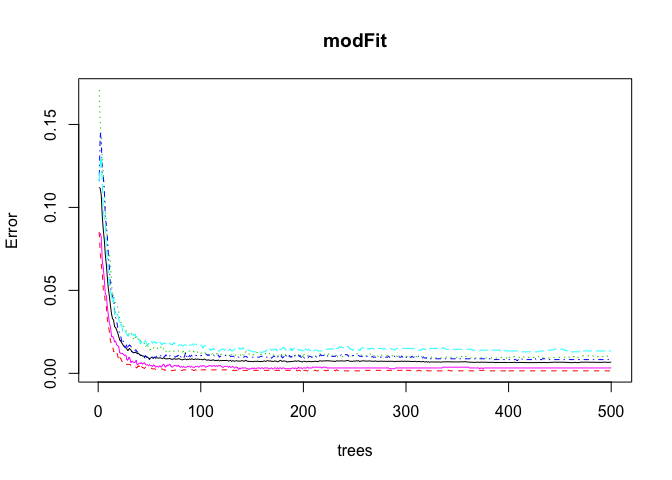
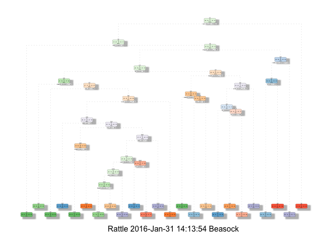

# Machine Learning: Prediction Assignment
Amber Beasock  
31 January 2016  

----------------------------------------------------------------------------------


### Project Overview

#### Background

Using devices such as Jawbone Up, Nike FuelBand, and Fitbit it is now possible to collect a large amount of data about personal activity relatively inexpensively. These type of devices are part of the quantified self movement – a group of enthusiasts who take measurements about themselves regularly to improve their health, to find patterns in their behavior, or because they are tech geeks. One thing that people regularly do is quantify how much of a particular activity they do, but they rarely quantify how well they do it. In this project, your goal will be to use data from accelerometers on the belt, forearm, arm, and dumbell of 6 participants. They were asked to perform barbell lifts correctly and incorrectly in 5 different ways. More information is available from the website [here](http://groupware.les.inf.puc-rio.br/har) (see the section on the Weight Lifting Exercise Dataset).

#### Data

The training data for this project are available here:
<https://d396qusza40orc.cloudfront.net/predmachlearn/pml-training.csv>

The test data are available here:
<https://d396qusza40orc.cloudfront.net/predmachlearn/pml-testing.csv>

The data for this project come from this source: <http://groupware.les.inf.puc-rio.br/har>. If you use the document you create for this class for any purpose please cite them as they have been very generous in allowing their data to be used for this kind of assignment.


The `classe` variable contains 5 different ways barbell lifts were performed correctly and incorrectly:

- Class A: exactly according to the specification
- Class B: throwing the elbows to the front
- Class C: lifting the dumbbell only halfway
- Class D: lowering the dumbbell only halfway
- Class E: throwing the hips to the front

#### Objective

The goal of your project is to predict the manner in which they did the exercise. This is the `classe` variable in the training set. You may use any of the other variables to predict with. You should create a report describing how you built your model, how you used cross validation, what you think the expected out of sample error is, and why you made the choices you did. You will also use your prediction model to predict 20 different test cases.

----------------------------------------------------------------------------------

### Loading the data

Packages used for analysis. This assumes the packages are already installed. Use the `install.packages("")` command if a package not installed yet.

```r
library(caret)
library(randomForest)
library(rpart)
library(rpart.plot)
library(RColorBrewer)
library(rattle)
```

Load the data into R

```r
# The location where the training data is to be downloaded from
train_url <- "https://d396qusza40orc.cloudfront.net/predmachlearn/pml-training.csv"
# The location where the testing data is to be downloaded from
test_url <- "https://d396qusza40orc.cloudfront.net/predmachlearn/pml-testing.csv"

#Before downloading the data, you can change your working directory by setting the path in setwd()
# Download the training data in your working directory, if it hasn't been already
if (!file.exists("train_data.csv")){
  download.file(train_url, destfile="train_data.csv", method="curl")
}
# Download the testing data in your working directory
if (!file.exists("test_data.csv")){
download.file(test_url, destfile="test_data.csv", method="curl")
}

# Read the Training CSV file into R & replace missing values & excel division error strings #DIV/0! with 'NA'
train_data <- read.csv("train_data.csv", na.strings=c("NA","#DIV/0!",""), header=TRUE)

# Read the Testing CSV file into R & replace missing values & excel division error strings #DIV/0! with 'NA'
test_data <- read.csv("test_data.csv", na.strings=c("NA","#DIV/0!",""), header=TRUE)

# Take a look at the Training data classe variable
summary(train_data$classe)
```

```
##    A    B    C    D    E 
## 5580 3797 3422 3216 3607
```

### Partitioning the data for Cross-validation

The training data is split into two data sets, one for training the model and one for testing the performance of our model. The data is partitioned by the `classe` variable, which is the varible we will be predicting. The data is split into 60% for training and 40% for testing.


```r
inTrain <- createDataPartition(y=train_data$classe, p = 0.60, list=FALSE)
training <- train_data[inTrain,]
testing <- train_data[-inTrain,]

dim(training); dim(testing)
```

```
## [1] 11776   160
```

```
## [1] 7846  160
```

### Data Processing
Drop the first 7 variables because these are made up of metadata that would cause the model to perform poorly.

```r
training <- training[,-c(1:7)]
```

Remove NearZeroVariance variables

```r
nzv <- nearZeroVar(training, saveMetrics=TRUE)
training <- training[, nzv$nzv==FALSE]
```

There are a lot of variables where most of the values are 'NA'. Drop variables that have 60% or more of the values as 'NA'.

```r
training_clean <- training
for(i in 1:length(training)) {
  if( sum( is.na( training[, i] ) ) /nrow(training) >= .6) {
    for(j in 1:length(training_clean)) {
      if( length( grep(names(training[i]), names(training_clean)[j]) ) == 1)  {
        training_clean <- training_clean[ , -j]
      }   
    } 
  }
}

# Set the new cleaned up dataset back to the old dataset name
training <- training_clean
```

Transform the test_data dataset

```r
# Get the column names in the training dataset
columns <- colnames(training)
# Drop the class variable
columns2 <- colnames(training[, -53])
# Subset the test data on the variables that are in the training data set
test_data <- test_data[columns2]
dim(test_data)
```

```
## [1] 20 52
```

### Cross-Validation: Prediction with Random Forest

A Random Forest model is built on the training set. Then the results are evaluated on the test set

```r
set.seed(54321)
modFit <- randomForest(classe ~ ., data=training)
prediction <- predict(modFit, testing)
cm <- confusionMatrix(prediction, testing$classe)
print(cm)
```

```
## Confusion Matrix and Statistics
## 
##           Reference
## Prediction    A    B    C    D    E
##          A 2229    9    0    0    0
##          B    2 1504   19    0    0
##          C    0    5 1347   20    0
##          D    0    0    2 1265    5
##          E    1    0    0    1 1437
## 
## Overall Statistics
##                                           
##                Accuracy : 0.9918          
##                  95% CI : (0.9896, 0.9937)
##     No Information Rate : 0.2845          
##     P-Value [Acc > NIR] : < 2.2e-16       
##                                           
##                   Kappa : 0.9897          
##  Mcnemar's Test P-Value : NA              
## 
## Statistics by Class:
## 
##                      Class: A Class: B Class: C Class: D Class: E
## Sensitivity            0.9987   0.9908   0.9846   0.9837   0.9965
## Specificity            0.9984   0.9967   0.9961   0.9989   0.9997
## Pos Pred Value         0.9960   0.9862   0.9818   0.9945   0.9986
## Neg Pred Value         0.9995   0.9978   0.9968   0.9968   0.9992
## Prevalence             0.2845   0.1935   0.1744   0.1639   0.1838
## Detection Rate         0.2841   0.1917   0.1717   0.1612   0.1832
## Detection Prevalence   0.2852   0.1944   0.1749   0.1621   0.1834
## Balanced Accuracy      0.9985   0.9937   0.9904   0.9913   0.9981
```


```r
overall.accuracy <- round(cm$overall['Accuracy'] * 100, 2)
sam.err <- round(1 - cm$overall['Accuracy'],2)
```

The model is 99.18% accurate on the testing data partitioned from the training data. The expected out of sample error is roughly 0.01%. 


```r
plot(modFit)
```

 

In the above figure, error rates of the model are plotted over 500 trees. The error rate is less than 0.04 for all 5 classe. 

### Cross-Validation: Prediction with a Decision Tree


```r
set.seed(54321)
modFit2 <- rpart(classe ~ ., data=training, method="class")
prediction2 <- predict(modFit2, testing, type="class")
cm2 <- confusionMatrix(prediction2, testing$classe)
print(cm2)
```

```
## Confusion Matrix and Statistics
## 
##           Reference
## Prediction    A    B    C    D    E
##          A 1978  304   26  132   49
##          B   76  836   70   35   93
##          C   74  183 1157  210  187
##          D   69  108   89  816   76
##          E   35   87   26   93 1037
## 
## Overall Statistics
##                                           
##                Accuracy : 0.7423          
##                  95% CI : (0.7325, 0.7519)
##     No Information Rate : 0.2845          
##     P-Value [Acc > NIR] : < 2.2e-16       
##                                           
##                   Kappa : 0.673           
##  Mcnemar's Test P-Value : < 2.2e-16       
## 
## Statistics by Class:
## 
##                      Class: A Class: B Class: C Class: D Class: E
## Sensitivity            0.8862   0.5507   0.8458   0.6345   0.7191
## Specificity            0.9090   0.9567   0.8990   0.9479   0.9624
## Pos Pred Value         0.7947   0.7532   0.6389   0.7047   0.8114
## Neg Pred Value         0.9526   0.8988   0.9650   0.9297   0.9383
## Prevalence             0.2845   0.1935   0.1744   0.1639   0.1838
## Detection Rate         0.2521   0.1066   0.1475   0.1040   0.1322
## Detection Prevalence   0.3172   0.1415   0.2308   0.1476   0.1629
## Balanced Accuracy      0.8976   0.7537   0.8724   0.7912   0.8408
```


```r
overall.accuracy2 <- round(cm2$overall['Accuracy'] * 100, 2)
sam.err2 <- round(1 - cm2$overall['Accuracy'],2)
```

The model is 74.23% accurate on the testing data partitioned from the training data. The expected out of sample error is roughly 0.26%. 

Plot the decision tree model

```r
fancyRpartPlot(modFit2)
```

```
## Warning: labs do not fit even at cex 0.15, there may be some overplotting
```

 

### Prediction on the Test Data

The Random Forest model gave an accuracy of 99.18%, which is much higher than the 74.23% accuracy from the Decision Tree. So we will use the Random Forest model to make the predictions on the test data to predict the way 20 participates performed the exercise.

```r
final_prediction <- predict(modFit, test_data, type="class")
print(final_prediction)
```

```
##  1  2  3  4  5  6  7  8  9 10 11 12 13 14 15 16 17 18 19 20 
##  B  A  B  A  A  E  D  B  A  A  B  C  B  A  E  E  A  B  B  B 
## Levels: A B C D E
```

### Conclusion

There are many different machine learning algorithms. I chose to compare a Random Forest and Decision Tree model. For this data, the Random Forest proved to be a more accurate way to predict the manner in which the exercise was done.
